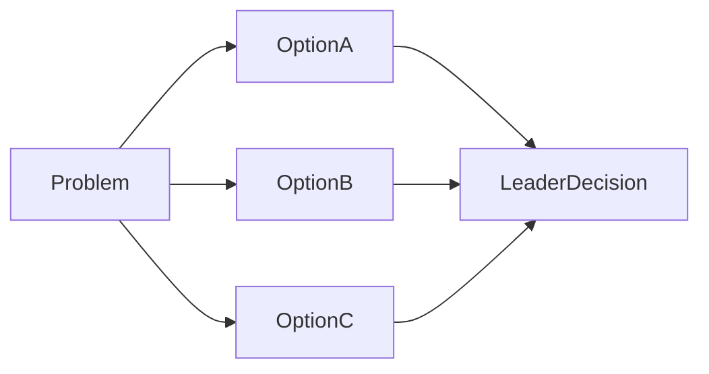

# Decision Record / Options Paper

> **Template instructions:** Replace all `{placeholders}`. Present options for leader decision — do not decide on the leader's behalf. Suitable for technical research conclusions, governance decisions, and material trade-offs.

---

## Document metadata

| Field | Value |
|---|---|
| Date | {date} |
| Author | {author} |
| Audience | {audience} |
| Decision title | {decision_title} |
| Decision required by | {decision_date} |
| Organisation | {Organisation} |
| Decision status | Draft / Pending leader approval / Decided |
| Version | {version} |
| Classification | Internal / [REDACTED] where applicable |

---

## Executive summary

{Decision in one sentence. Recommended option for leader consideration. Key trade-off.}

**Ask:** {Specific decision required from the audience.}

---

## Context and scope

**Background:** {Why this decision is needed now.}

**Decision scope:**
- {What is being decided}
- {What is explicitly not being decided}

**Research or analysis scope** (if applicable):
- {Questions investigated}
- {Sources consulted — leader-provided or cited}

---

## Evidence table

| # | Claim | Type | Source | Date | Confidence |
|---|---|---|---|---|---|
| 1 | {claim} | [Evidence] / [Inference] / [Assumption] / [Unknown] | {source} | {date} | High / Medium / Low |

---

## Assumptions and unknowns

### Assumptions
- [Assumption] {assumption}

### Unknowns
- [Unknown] {gap} — {impact on decision quality}

---

## Analysis and findings

### Problem statement
{Clear articulation of the leadership or systems problem.}

### Research findings (if technical research brief)
{Evidence-led summary of options evaluated, with sources.}

### Constraints
{Regulatory, budget, timeline, technical, organisational.}

### Optional diagram

---

## Options and trade-offs

### Option A: {name}

| Dimension | Assessment |
|---|---|
| Description | |
| Benefits | |
| Costs / effort | |
| Risks | |
| Reversibility | High / Medium / Low |
| Blast radius | |
| Control considerations | |
| Evidence basis | #refs |

### Option B: {name}

{Repeat structure.}

### Option C: Do nothing / defer

{Repeat structure.}

### Comparison summary

| Criterion | Option A | Option B | Option C |
|---|---|---|---|
| {criterion} | | | |

---

## Recommendations (for leader consideration)

> Recommendation for the leader's consideration — not a final decision.

**Recommended option:** {Option X}

**Rationale:** {Evidence-linked reasoning.}

**Conditions:** {What must be true for this recommendation to hold.}

---

## Responsible AI considerations (if applicable)

- Human accountability: {who retains decision ownership}
- Data and privacy: {considerations}
- Limitations: {what the AI/tooling cannot guarantee}
- Residual risk: {leader must accept explicitly}

---

## Risks and controls considerations

| Risk | Related option(s) | Mitigation considerations | Evidence |
|---|---|---|---|
| {risk} | | | #ref |

---

## Human decision required

- [ ] Options and evidence reviewed
- [ ] **Decision:** Option A / Option B / Option C / Other: {specify}
- [ ] Rationale for decision: {leader to complete}
- [ ] Approved for communication to: {audience}
- [ ] Follow-up actions agreed

**Leader signature / date:** _______________

---

## Review checklist

- [ ] At least two viable options presented (where possible)
- [ ] No compliance or audit sign-off claimed by the agent
- [ ] All material claims in evidence table
- [ ] Recommendation framed for leader consideration only
- [ ] British English throughout
