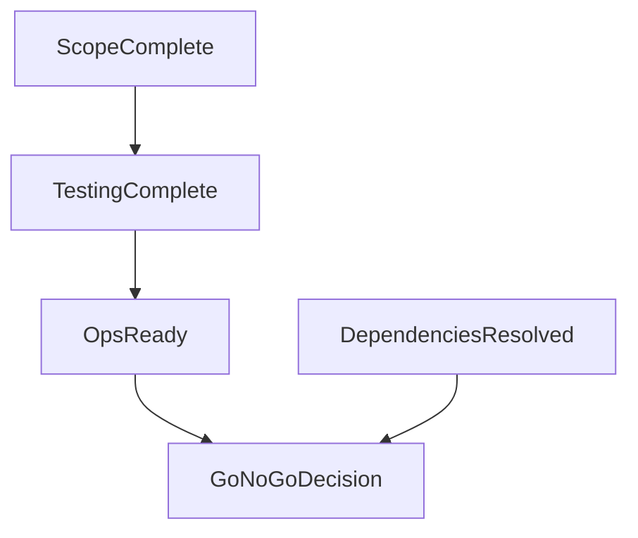

# Delivery Assurance Summary

> **Template instructions:** Replace all `{placeholders}`. Assess readiness at programme or release level — not individual accountability. Label all claims. Do not assign blame to named individuals.

---

## Document metadata

| Field | Value |
|---|---|
| Date | {date} |
| Author | {author} |
| Audience | {audience} |
| Programme / release | {programme_name} |
| Target date | {target_date} |
| Organisation | {Organisation} |
| Decision status | Draft / Pending leader approval / Approved |
| Version | {version} |
| Classification | Internal / [REDACTED] where applicable |

---

## Executive summary

{Readiness verdict in plain language — avoid false precision. State confidence level and key blockers.}

**Ask:** {Go / no-go / conditional go decision required from whom.}

---

## Context and scope

**Delivery objective:** {What is being delivered and why it matters.}

**Assurance scope:**
- {In-scope deliverables, environments, dependencies}

**Out of scope:**
- Individual performance review
- {Other exclusions}

---

## Evidence table

| # | Claim | Type | Source | Date | Confidence |
|---|---|---|---|---|---|
| 1 | {claim} | [Evidence] / [Inference] / [Assumption] / [Unknown] | {source} | {date} | High / Medium / Low |

---

## Assumptions and unknowns

### Assumptions
- [Assumption] {assumption}

### Unknowns
- [Unknown] {gap}

---

## Readiness assessment

### Scope and requirements
{Completeness, change control, sign-off status — evidenced.}

### Quality and testing
{Test coverage themes, defect status, non-functional testing — no false "100% tested" claims without source.}

### Dependencies and integrations
{Upstream/downstream dependencies and status.}

### Operational readiness
{Runbooks, monitoring, support model, rollback — at role/system level.}

### Regulatory and control considerations
{Observations relevant to regulated context — not compliance sign-off.}

### Optional diagram

---

## Blockers and mitigations

| # | Blocker | Severity | Mitigation | Owner role | Target date | Status |
|---|---|---|---|---|---|---|
| 1 | {blocker} | High/Med/Low | {mitigation} | {role — not named individual} | {date} | Open/Closed |

---

## Options and trade-offs

| Option | Description | Impact on date | Risk |
|---|---|---|---|
| Proceed as planned | | | |
| Proceed with scope reduction | | | |
| Defer | | | |

---

## Recommendations (for leader consideration)

1. **{Recommendation}** — {basis with evidence reference #}

---

## Risks and controls considerations

| Risk | If delivery proceeds | If delivery defers | Control considerations |
|---|---|---|---|
| {risk} | | | |

---

## Human decision required

- [ ] Readiness assessment reviewed against evidence table
- [ ] Blockers accepted or mitigations agreed
- [ ] **Decision:** Go / Conditional go / No-go
- [ ] Conditions (if conditional go): {conditions}
- [ ] Approved for communication to: {audience}

**Leader signature / date:** _______________

---

## Review checklist

- [ ] No blame assigned to named individuals
- [ ] Readiness language is evidenced, not aspirational
- [ ] Rollback and contingency addressed
- [ ] Evidence gap analysis completed (if material)
- [ ] British English throughout
