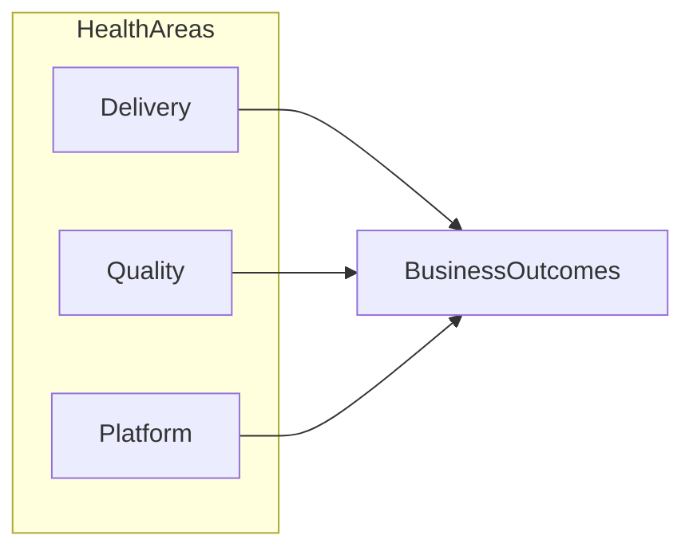

# Engineering Health Review Memo

> **Template instructions:** Replace all `{placeholders}`. Label every material claim in the evidence table. Do not assign health scores or RAG ratings without a defined metric, source, and date. Focus on systems and outcomes — not individuals.

---

## Document metadata

| Field | Value |
|---|---|
| Date | {date} |
| Author | {author} |
| Audience | {audience} (default: ExCo) |
| Review period | {review_period} |
| Organisation | {Organisation} |
| Decision status | Draft / Pending leader approval / Approved |
| Version | {version} |
| Classification | Internal / [REDACTED] where applicable |

---

## Executive summary

{2–4 sentences: overall engineering health at a systems level, key risks, and any decision required from the audience.}

**Ask:** {What the audience needs to decide or acknowledge.}

---

## Context and scope

**Purpose:** {Why this review is being conducted — e.g. quarterly health review, pre-audit preparation.}

**In scope:**
- {Systems, platforms, or capability areas reviewed}

**Out of scope:**
- Individual performance assessment
- {Other exclusions}

---

## Evidence table

| # | Claim | Type | Source | Date | Confidence |
|---|---|---|---|---|---|
| 1 | {claim} | [Evidence] / [Inference] / [Assumption] / [Unknown] | {source} | {date} | High / Medium / Low |

---

## Assumptions and unknowns

### Assumptions
- [Assumption] {assumption} — {impact if wrong}

### Unknowns
- [Unknown] {gap} — {why it matters}

---

## Analysis and findings

### Delivery and flow
{Throughput, predictability, blockers at a systems level.}

### Quality and reliability
{Defect trends, incident patterns, technical debt themes — with evidence references.}

### Architecture and platform
{Coupling, scalability, modernisation progress.}

### Security and compliance posture
{Observations only — not sign-off. Link to evidence.}

### Team capability and operating model
{Skills, autonomy, guardrails — roles and systems, not named individuals.}

### Optional diagram

---

## Options and trade-offs

| Option | Description | Benefits | Risks | Reversibility |
|---|---|---|---|---|
| A | {option} | | | High / Medium / Low |
| B | {option} | | | |

---

## Recommendations (for leader consideration)

> These are recommendations for the leader's consideration — not decisions or approvals.

1. **{Recommendation}** — [Evidence/Inference/Assumption] {basis}

---

## Risks and controls considerations

| Risk | Likelihood | Impact | Control considerations | Evidence |
|---|---|---|---|---|
| {risk} | Low/Med/High | Low/Med/High | {considerations — not effectiveness claims} | #ref |

---

## Human decision required

- [ ] I have reviewed the evidence table and assumptions
- [ ] I accept the recommendations as stated / with modifications: {notes}
- [ ] I approve this memo for sharing with: {audience}
- [ ] Decision: {pending / decided — leader to complete}

**Leader signature / date:** _______________

---

## Review checklist

- [ ] No named individual evaluation
- [ ] All material claims mapped in evidence table
- [ ] No unsupported RAG or numeric health scores
- [ ] Governance language is proportionate, not performative
- [ ] British English throughout
- [ ] Evidence gap analysis completed (if material)
