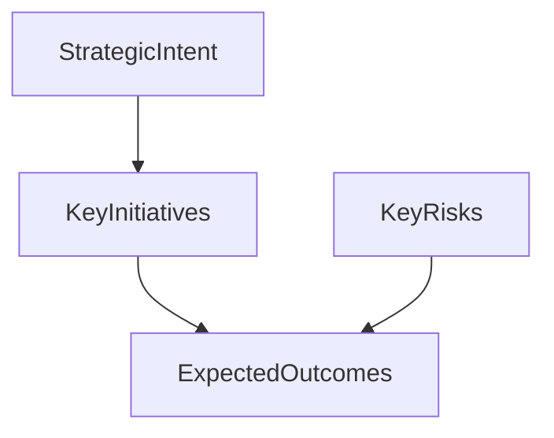

# Executive Briefing Note

> **Template instructions:** Replace all `{placeholders}`. Default audience is ExCo. Lead with the ask. Keep to 1–2 pages equivalent. Pair with `strategy-one-pager.html` when a visual summary is needed.

---

## Document metadata

| Field | Value |
|---|---|
| Date | {date} |
| Author | {author} |
| Audience | {audience} (default: ExCo) |
| Subject | {subject} |
| Organisation | {Organisation} |
| Decision status | Draft / Pending leader approval / Approved |
| Version | {version} |
| Classification | Internal / [REDACTED] where applicable |

---

## Executive summary

{3–5 sentences maximum: situation, complication, implication, and ask.}

**Ask:** {Clear request — decision, funding, awareness, or alignment.}

---

## Context and scope

**Situation:** {What ExCo needs to know about the current state — systems and outcomes.}

**Scope of this briefing:**
- {In scope}
- {Out of scope — including individual performance}

---

## Evidence table

| # | Claim | Type | Source | Date | Confidence |
|---|---|---|---|---|---|
| 1 | {claim} | [Evidence] / [Inference] / [Assumption] / [Unknown] | {source} | {date} | High / Medium / Low |

---

## Assumptions and unknowns

- [Assumption] {assumption}
- [Unknown] {gap}

---

## Key messages

1. **{Message}** — {one line supporting evidence #}
2. **{Message}** — {one line supporting evidence #}
3. **{Message}** — {one line supporting evidence #}

---

## Strategic or tactical detail

{Expanded context for questions — still concise. Organise by theme, not by individual.}

### Optional diagram

---

## Options and implications (if decision required)

| Option | Summary | Implication for {Organisation} |
|---|---|---|
| A | | |
| B | | |

---

## Recommendations (for leader consideration)

1. **{Recommendation}** — {basis}

---

## Risks and controls considerations

| Risk | Impact | Mitigation considerations |
|---|---|---|
| {risk} | | |

---

## Human decision required

- [ ] Briefing reviewed for factual accuracy and evidence traceability
- [ ] **Decision / ask response:** {leader to complete}
- [ ] Approved for presentation to: {audience}

**Leader signature / date:** _______________

---

## Review checklist

- [ ] Ask is clear in the first paragraph
- [ ] Suitable length for ExCo (1–2 pages)
- [ ] No named individual evaluation
- [ ] Visual one-pager (if used) matches this evidence table
- [ ] British English throughout

---

## Companion visual

If an executive one-pager is required, populate `templates/strategy-one-pager.html` using the same evidence references.
